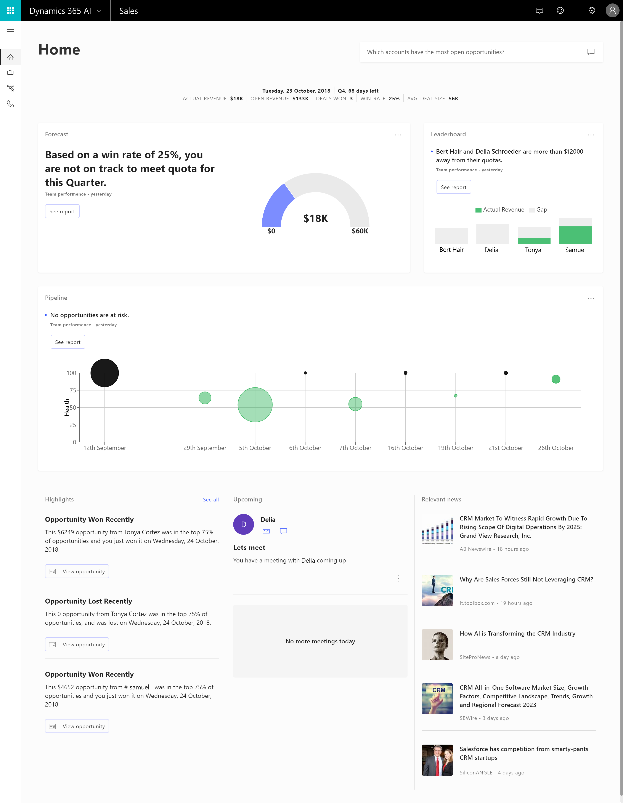
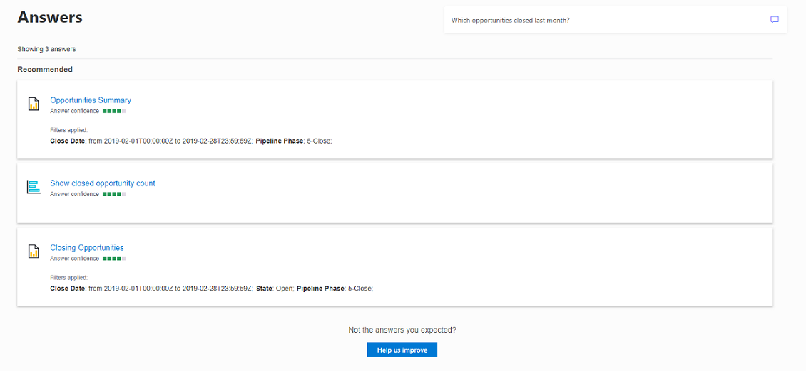
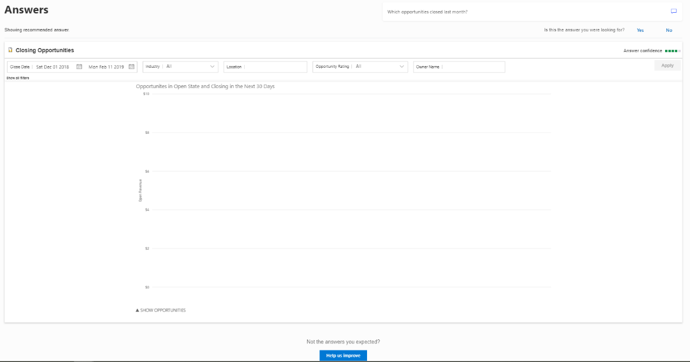
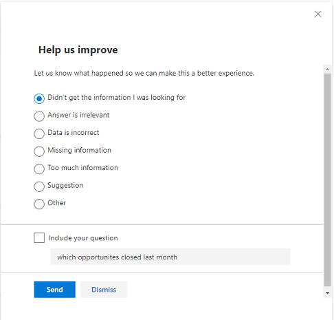
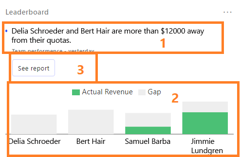
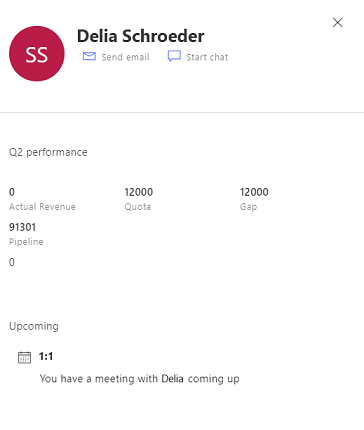
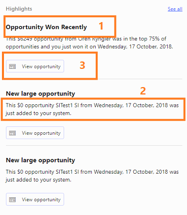
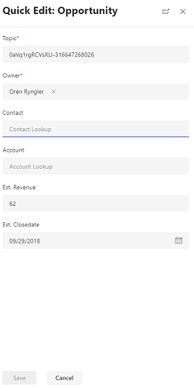

# Preview: View overall sales insights

Applies to [!INCLUDE[pn-crm-online](../includes/pn-crm-online.md)] version 9.1.0.

[!INCLUDE [cc-beta-prerelease-disclaimer](../includes/cc-beta-prerelease-disclaimer.md)]

> [!IMPORTANT]
> [!INCLUDE[cc_preview_features_definition](../includes/cc-preview-features-definition.md)]

When you sign in to the [!INCLUDE[pn_dynamics_sales_insights](../includes/pn-dynamics-sales-insights.md)] application, you'll see the home page, which provides high-level information on the forecast, leaderboard, pipeline, highlights, upcoming meetings, and relevant news. This tells you:

- The number of days left in the period to achieve your target quota.
- How much you have sold.
- The number of deals you have won.
- What your win rate is.

> [!NOTE]
> When you sign in for the first time, the application can take several minutes to gather the data and display visuals for you. A status message displays to update you on progress.

Using this information, you can quickly take action when necessary and drill deep into a particular report for more information. The following is an example of the home page.

> [!div class="mx-imgBorder"]
> 

## Natural language Q&A 

Sometimes you want quick answers from your data without searching through reports in the sections. The Microsoft Dynamics 365 Sales Insights application provides a natural language **Q&A** feature so you can ask questions using natural language. This enables you to explore your data using intuitive, natural language capabilities and receive answers in the form of charts and graphs.

For example, when you type "Which opportunities closed last month?", the application displays charts and graphs that contain details of the opportunities that closed last month. This does more than just “search” for a prepackaged answer.  If a good report for answering your questions exists, this report will be opened and automatically filtered based on your question. If a report does not already exist, the Sales Insights Q&A capability will automatically generate a result to answer your question.

The natural language Q&A capability of Sales Insights is an ever-evolving system and it is being improved based on your feedback. We recommend you provide feedback for both satisfactory and unsatisfactory results as we tune the capability to work best for your questions.

To learn more on improving the search, see [Provide feedback to improve search results](#provide-feedback-to-improve-search-results).
To get started asking questions, you can use the Q&A text box on the Sales Insights home page:

> [!div class="mx-imgBorder"]
> 

### Ask a question

On the home page, type a conversational question in the **search** text box and press **Enter**. For example, enter **Which opportunities closed last month?** and the **Answers** screen opens with the potential results that are related to the question.

> [!NOTE]
> You can also open the **Answers** screen by selecting the chat icon.

> [!div class="mx-imgBorder"]
> 

The three recommended answers displayed in the results set are the most relevant to the question. You can select and open the relevant results. Here we have selected **Closing Opportunities**. 

> [!div class="mx-imgBorder"]
> 

You can refine the report by applying filters. Set the filters and select **Apply**. You can also review the **Answer confidence**, which defines the accuracy of the results.

For more examples of asking questions, see [Reference](#reference).

### Provide feedback to improve search results

At times, the results that the application fetches might not be accurate or relevant to the question you asked. In such cases, you can improve the search results by providing feedback. This feedback helps the application to improve the search results and display more appropriate results in the future. You can always measure the accuracy of the result by viewing the **Answer confidence** in the result page. Follow these steps to provide feedback:

1. Sign in to the **Sales Insights** application.
2. In the **Q&A** text box, type a question and press **Enter**.
3. If you do not find the appropriate suggestions in response to your question, select **Help us improve**. 

    > [!div class="mx-imgBorder"]
    > 
    
    **-OR-**

    If the displayed report is not an appropriate answer to your question, on the result page, select **No** for the question **Is this the answer you were looking for?** 

    > [!div class="mx-imgBorder"]
    > 

4. The **Help us improve** sidekick opens. Choose the appropriate response and select **Send**.
    
    > [!div class="mx-imgBorder"]
    > 

    A confirmation message displays and the questionnaire is sent to the application. This should result in more relevant answers the next time you search.

### Reference

Let’s look at the following three scenarios on how to use the Sales Insights Q&A in your organization.

- [Scenario 1: Sales manager preparing for meeting to coach seller](#scenario-1-sales-manager-preparing-for-meeting-to-coach-seller)
- [Scenario 2: Sales manager preparing for business review meeting with sales leadership](#scenario-2-sales-manager-preparing-for-business-review-meeting-with-sales-leadership)
- [Scenario 3: Track sales performance and monitor progress on goals of the sales team](#scenario-3-track-sales-performance-and-monitor-progress-on-goals-of-the-sales-team)
 
#### Scenario 1: Sales manager preparing for meeting to coach seller

**Objective**: The goal of this scenario is to help you as a sales manager to improve the sales performance of a seller.

**Frequency**: When and where you can use this scenario:
- Daily, weekly, biweekly, monthly, and periodically
- During organization-wide performance review periods
- When a seller is underachieving

**Example motive**: You have a biweekly meeting with Bert Hair tomorrow and you want reports and information on how he is performing.

**Questions**: You can ask the following types of questions to the Sales Insights Q&A.

|Type of question|Question|Description|
|----------------|--------|-----------|
|**Exploratory questions**|What is the scorecard for Bert Hair   What is the pipeline trend for Bert Hair?| View summarized data related to open leads, open opportunities, and gap-to-quota for Bert Hair and identify potential challenges with meeting his quota.     See Bert Hair's pipeline and opportunities with upcoming close dates that are most urgent to address.|
|**Focus in on specific leads and opportunities**|What are the oldest leads?   Show opportunities owned by Bert Hair closing this month    Which opportunities are at risk for Bert Hair?    What is the pipeline hygiene for Bert Hair?|See ranking of oldest leads. Coach Bert Hair on how to close the oldest leads.    Dive into open opportunities that are closing soon and sort open opportunities by largest estimated revenue. Help Bert Hair identify best opportunities to continue to pursue to meet his quota.    Review opportunities that are at risk by stage and by health score. Coach Bert Hair on how to close these opportunities.    Review opportunities with incorrect or missing information. Ask Bert Hair to update information so that you (the sales manager) can properly review all opportunities when preparing for the next coaching meeting.|
|**Compare performance to peers**| Show me the team scorecard    Compare Bert Hair and Amos Olive    How well are sales people doing at winning big opportunities? | See how the seller is performing compared to his peers on different metrics (won revenue, won opportunity count, attainment). Identify if the seller's performance is below or above the average sales people.   Compare Bert Hair's performance with a seller who owns a similar account.   See a correlation between opportunity size and win ratio by sales people.|

**Business outcome**: With the help of this information, you can:
- Provide constructive feedback or support to the seller.
- Coach the seller on sales techniques.
- Devise an action plan to win deals.

#### Scenario 2: Sales manager preparing for business review meeting with sales leadership

**Objective**: The goal of this scenario is to help you as a sales manager to analyze and present the performance of the sales team to sales leadership.

**Frequency**: When and where you can use this scenario:
- Monthly, periodically, quarterly, half yearly, and annually
- During organization-wide performance review periods
- For strategic business planning meetings

**Example motive**: You and other sales managers need to provide a business update on the performance sales teams—including yours—next week at a sales leadership meeting in New York.

**Questions**: You can ask the following types of questions to the Sales Insights Q&A.

|Type of question|Question|Description|
|----------------|--------|-----------|
|**Review sales history**|What are the sales results for this period?|View summary of wins and losses for the period.|
|**Review sales pipeline and sales targets**|Show me my quota    Show me our sales pipeline    Show our pipeline by sale stage|Review overall target, attainment, and gap-to-quota in Sales Forecast Summary report.    Review open opportunities in the pipeline.    See pipeline by opportunity phase and dive into details of different opportunities that can potentially cover gap.|
|**Trend analysis**|How does my won opportunity trend this period compare to the prior period?    How does this period trend compare to last year?|Compare opportunities trend this period to last period to see how sales are trending for the year.    Compare opportunities trend this period to same period last year to see how similar business lifecycle phases compare year over year.|

**Business outcome**: With the help of this information, you can:
- Provide updates to sales leadership regarding wins, losses, and open sales including sales trends.
- Work with sales leadership to identify deals to target those that align with the company strategy.

#### Scenario 3: Track sales performance and monitor progress on goals of the sales team

**Objective**: You want to analyze the sales pipeline and identify gaps in sales targets to see if you can meet sales goals (biweekly, monthly, or quarterly).

**Frequency**: When and where you can use this scenario:
- Daily, weekly, biweekly, monthly, periodically, and quarterly
- For strategic business planning meetings

**Example motive**: You want to see how well your sales team is performing and if you are going to meet sales targets for the period.

**Questions**: You can ask the following types of questions to the Sales Insights Q&A.

|Type of question|Question|Description|
|----------------|--------|-----------|
|**Exploratory questions**|Show me my quota    Show me my gap-to-quota|Review overall target, attainment, and gap-to-quota in the Sales Forecast Summary report.|
|**Review opportunities to close gap**|Show me my pipeline    Show me a list of past-due opportunities    Open opportunities in propose phase    Which opportunities are at risk?    Are we going to meet quota?|See pipeline of opportunities that can potentially cover gaps in the Sales Pipeline Summary or Pipeline Trend report.    Review past-due opportunities that need to be addressed immediately.    Review opportunities that are in the propose phase and most likely to be closed soon in the Opportunities Summary report.    Review opportunities that are at risk by stage and by health score in the Pipeline Health and Risk report.   Review what-if scenarios to forecast if the target will be met.|
|**Review recent wins and losses**|What are the sales results for this period?    How does my won opportunity trend this period compare to the prior period?    How does my lost opportunity trend this period compare to the prior period?|View summary of wins and loss for the period.      Compare opportunity trend this period to last period.|

**Business outcome**: With the help of this information, you can plan your strategy to win deals that meet business and target goals.

## Base KPIs

The base KPIs provide information on the status of your current sales period. The following is an example of how the base KPIs are displayed.

> [!div class="mx-imgBorder"]
> 

By viewing these KPIs, you’ll know:

- The time left in the current period to achieve your sales target.
- The sum of actual revenue of all won opportunities.
- The total estimated revenues of all open opportunities.
- The total deals that are won by you in this period.
- The percentage of deals that you have won against available opportunities in this period.
- The average revenue generated through each deal in this period.

## Forecast

Using the **Forecast** section, you can predict how your team is performing to achieve their quota for the period. The following is an example of how a forecast is displayed. 

> [!div class="mx-imgBorder"]
> 

The Forecast section is classified into the following subsections:

1. **Insights message**: Displays a message on how your team is performing. For example, your target is $60,000 and so far, your achievement is only $18,000 with 30 days left to close the target. The application predicts that your team has achieved only a 30% win rate and displays the message, “Based on a win rate of 30%, you are not on track to meet the quota for this Quarter.”
1. **Overall quota**: Displays your team's progress in achieving the sales targets for the current period. You can see a comparison between actual revenue generated and the remaining target revenue to be achieved for the period.
1. **Quick view**: Select **See report** to open Forecast in a quick-view pane on the home page. This quick-view pane provides a glance at the forecast. From the quick-view pane, you can go into a detailed view of the forecast. The following is an example of how a forecast pane is displayed:
    
    > [!div class="mx-imgBorder"]
    >  

    Select the **View full report** icon  on the Forecast pane to go to the Forecast tab. [!INCLUDE[proc_more_information](../includes/proc-more-information.md)] [Analyze team performance](../sales/d365-ai-team-performance.md)
  
## Leaderboard

The **Leaderboard** section provides information on how each sales rep is performing in the current sales period. The following is an example of how a Leaderboard is displayed:

> [!div class="mx-imgBorder"]
> 

The Leaderboard section is classified into the following subsections:

1. **Insights message**: Displays a message on which sales rep is falling behind in achieving the quota for the period. For example, Delia Schroeder, Samuel Barba, Bert Hair, and Jimmie Lundgren are sales reps who report to you and have set individual revenue targets. Through the graph, you can see that Delia Schroeder and Bert Hair did not generate any revenue against their set targets. The application predicts that Delia Schroeder and Bert Hair will not achieve their target quota and they are more than $12,000 away from doing so. The Insights message says, “Delia Schroeder and Bert Hair are more than $12,000 away from achieving their quotas.”
1. **Sales reps performance**: Displays the progress of each sales rep in achieving their quota. The bar chart shows the actual revenue (green) generated against the assigned quota (grey). 
To further drill down into individual performance, select the bar representing the sales rep. In the following example, we selected Delia Schroeder. A pane appears on the screen with her performance information along with the upcoming schedule:

   > [!div class="mx-imgBorder"]
   >  

   The information includes actual revenue generated against the quota, target quota, gap between the actual revenue and quota, and opportunities available in the pipeline. In the **Upcoming** section, you can see her scheduled meetings and select the meeting request to view the details. You can also send a note through email or start a chat to discuss the progress in achieving the target.

1. **Quick view**: Select **See report** to open Leaderboard in a quick-view pane on the home page. This quick-view pane provides a glance at the performance of each sales rep. From this quick-view pane, you can go further into a detailed view of the Leaderboard. The following is an example of how a Leaderboard pane is displayed:
    
   > [!div class="mx-imgBorder"]
   >  

Select the **View full report** icon  on the Leaderboard pane to go to the **Leaderboard** tab. [!INCLUDE[proc_more_information](../includes/proc-more-information.md)] [View sales rep performance](../sales/d365-ai-team-performance.md#leaderboard)

## Pipeline

The Pipeline section provides a view of the relationship health in your upcoming pipeline. The following is an example of how a Pipeline is displayed:
    
> [!div class="mx-imgBorder"]
> 

1.	**Insights message**: Displays a message about how your opportunities are trending for the period. For example, you have an opportunity with an ACME customer whose health score is decreasing and the closing is in 12 days. The application predicts the opportunity is at risk and displays the message, “ACME opportunity has low health score and is closing in 12 days.”
1. **Pipeline view**: Displays the opportunities that are closing soon and are at risk. The opportunities are displayed as bubbles on the graph, where the x-axis represent the dates and the y-axis represents the health score. To further understand the opportunities, hover over the bubble to see the estimated revenue, closing date, and health parameters. The size of the bubble determines the estimated cost and color determines the health condition.
1. **Quick view**: Select **See report** to open Pipeline in a quick-view pane on the home page. This quick-view pane provides a glance at the deals along with their health score. From this quick-view pane, you can go into a detailed view of the pipeline. The following is an example of how a Pipeline pane is displayed:

   > [!div class="mx-imgBorder"]
   >  

Select the **View full report** icon  on the Pipeline pane to go to the Pipeline tab. [!INCLUDE[proc_more_information](../includes/proc-more-information.md)] [View potential opportunities](/sales/d365-ai-business-performance.md#pipeline)

## Highlights

Your team is constantly at work interacting with customers, closing deals, opening opportunities, or even failing to close deals. Highlights helps you keep track of these items in real time so you can get involved when necessary. This information is displayed as cards. You will see the relationship assistant cards that are relevant to you and your team along with cards that are defined for new, won, and lost opportunities by your team. [!INCLUDE[proc_more_information](../includes/proc-more-information.md)] [Action cards reference](/dynamics365/customer-engagement/sales-enterprise/action-cards-reference) 
 
The following is an example of how a Highlights section is displayed:

> [!div class="mx-imgBorder"]
> 

1. **Title**: Provides a high-level description of what the item is about. For example, recently you won an opportunity and the heading is displayed as “Opportunity Won Recently.”
1. **Description**: Provides a detailed description of the item. The description includes the sales rep name, close date, opportunity value, and the name of the opportunity. For example, a large opportunity worth $50,000 is added to your system and the description is displayed as “This $50,000 opportunity Bert Hair from Wednesday, 17 October 2018, was just added to your system”. 
1. **See all insights**: Select **See all** on the Highlights section to view the items that got highlighted recently.
Select **View opportunity** to open the quick-edit pane on an opportunity that you want to quickly edit. This helps you not move away from the home page to access the opportunity. On these cards, you can perform actions such as:

   - Leave a congratulatory note on a won deal. 
   - Edit details of an opportunity in the context.    
   - Send a quick email to inquire about an opportunity at risk.
   - Quickly set up a meeting with a sales rep.

   The following is an example of how a quick-edit form displays:

   > [!div class="mx-imgBorder"]
   >  

## Upcoming

The **Upcoming** section provides information on your upcoming 1-on-1 meetings with sales reps. Use these 1-on-1 meetings to coach the sales reps on topics such as big deals that were just won or winnable deals that were lost. The following is an example of how an Upcoming section is displayed:

> [!div class="mx-imgBorder"]
> 

Each appointment displays the name with whom you have the appointment, subject, and description. You can view the details of the sales rep such as performance and opportunities that are at risk. Select **View scorecard** to view the details. With these details, you can assess the situation and get information before you meet with the sales rep. Also, you can send an email, or chat with the sales rep before the meeting.

Select **More options** to snooze or dismiss the appointment.

## Relevant news

The **Relevant news** section keeps you informed on the latest news about your products, customers, and industry. The following is an example of how Relevant news is displayed:

> [!div class="mx-imgBorder"]
> 

## Privacy notice  

For specific privacy information about [!INCLUDE[pn_dynamics_sales_insights](../includes/pn-dynamics-sales-insights.md)] capabilities for sales managers, see [Privacy notice](privacy-notice-manager.md).
