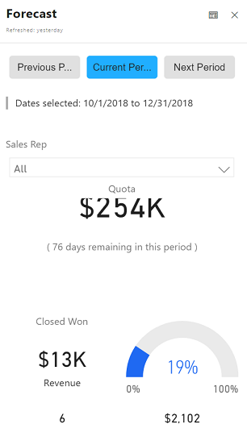
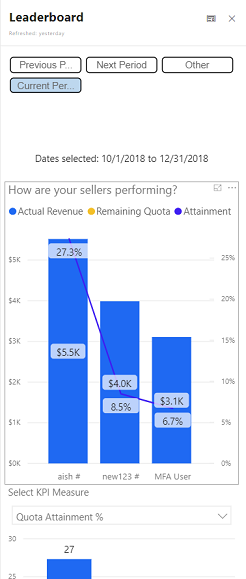
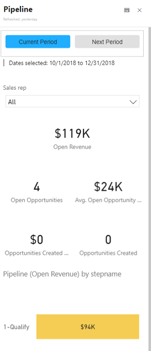
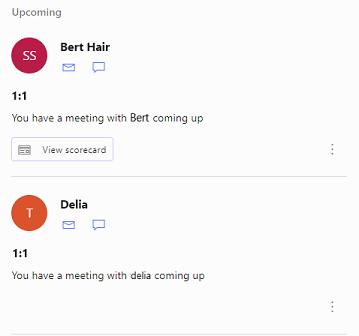
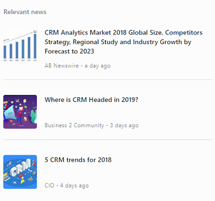

# Preview: View overall sales insights

Applies to Dynamics 365 (online), version 9.1.0  

When you sign in to the [!INCLUDE[pn_dynamics_ai_sales](../includes/pn-dynamics-ai-sales.md)] application, you'll see the home page, which provides high-level information on the forecast, leaderboard, pipeline, highlights, upcoming meetings, and relevant news. This tells you:

- The number of days left in the period to achieve your target quota.
- How much you have sold.
- The number of deals you have won.
- What your win rate is.

> [!NOTE]
> When you sign in for the first time, the application can take several minutes to gather the data and display visuals for you. A status message displays to update you on progress.

Using this information, you can quickly take action when necessary and drill deep into a particular report for more information. The following is an example of the home page.

> [!div class="mx-imgBorder"]
> 

## Q&A 

Sometimes you want quick answers from your data without searching through reports in the sections. The Dynamics 365 AI for Sales app provides a Q&A feature so you can ask questions using natural language. Use **Q&A** to explore your data using intuitive, natural language capabilities and receive answers in the form of charts and graphs. For example, when you type "what were total sales last year," the application displays charts and graphs that contain details of your sales last year. Q&A is different from a search engine—Q&A only provides results about the data in your reports.

Q&A displays as follows on the home page:

> [!div class="mx-imgBorder"]
> 

Type a question into the text box and press **Enter**. For example, enter “what is the revenue by sales person?” The Q&A screen opens with a visualization of the results.

> [!NOTE]
> You can also open the Q&A screen by selecting the chat icon.

> [!div class="mx-imgBorder"]
> 

You can see that some attributes in your question are highlighted. When you select the highlighted attribute, other attributes related to it are displayed. You can select the relevant attribute to change your question. For example, revenue is highlighted in the questions and when you select revenue, other attributes related to revenue are displayed.

> [!div class="mx-imgBorder"]
> 

Q&A provides you with predefined questions. You can customize these predefined questions to fit your requirements. Select the question and key attributes are highlighted. Select these key attributes and change them according to your requirements. The results are updated to display your modified question.

## Base KPIs

The base KPIs provide information on the status of your current sales period. The following is an example of how the base KPIs are displayed.

> [!div class="mx-imgBorder"]
> 

By viewing these KPIs, you’ll know:

- The time left in the current period to achieve your sales target.
- The sum of actual revenue of all won opportunities.
- The total estimated revenues of all open opportunities.
- The total deals that are won by you in this period.
- The percentage of deals that you have won against available opportunities in this period.
- The average revenue generated through each deal in this period.

## Forecast

Using the **Forecast** section, you can predict how your team is performing to achieve their quota for the period. The following is an example of how a forecast is displayed. 

> [!div class="mx-imgBorder"]
> 

The Forecast section is classified into the following subsections:

1. **Insights message**: Displays a message on how your team is performing. For example, your target is $60,000 and so far, your achievement is only $18,000 with 30 days left to close the target. The application predicts that your team has achieved only a 30% win rate and displays the message, “Based on a win rate of 30%, you are not on track to meet the quota for this Quarter.”
1. **Overall quota**: Displays your team's progress in achieving the sales targets for the current period. You can see a comparison between actual revenue generated and the remaining target revenue to be achieved for the period.
1. **Quick view**: Select **See report** to open Forecast in a quick-view pane on the home page. This quick-view pane provides a glance at the forecast. From the quick-view pane, you can go into a detailed view of the forecast. The following is an example of how a forecast pane is displayed:
    
    > [!div class="mx-imgBorder"]
    >  

    Select the **View full report** icon  on the Forecast pane to go to the Forecast tab. [!INCLUDE[proc_more_information](../includes/proc-more-information.md)] [Analyze team performance](../sales/d365-ai-team-performance.md)
  
## Leaderboard

The **Leaderboard** section provides information on how each sales rep is performing in the current sales period. The following is an example of how a Leaderboard is displayed:

> [!div class="mx-imgBorder"]
> 

The Leaderboard section is classified into the following subsections:

1. **Insights message**: Displays a message on which sales rep is falling behind in achieving the quota for the period. For example, Delia Schroeder, Samuel Barba, Bert Hair, and Jimmie Lundgren are sales reps who report to you and have set individual revenue targets. Through the graph, you can see that Delia Schroeder and Bert Hair did not generate any revenue against their set targets. The application predicts that Delia Schroeder and Bert Hair will not achieve their target quota and they are more than $12,000 away from doing so. The Insights message says, “Delia Schroeder and Bert Hair are more than $12,000 away from achieving their quotas.”
1. **Sales reps performance**: Displays the progress of each sales rep in achieving their quota. The bar chart shows the actual revenue (green) generated against the assigned quota (grey). 
To further drill down into individual performance, select the bar representing the sales rep. In the following example, we selected Delia Schroeder. A pane appears on the screen with her performance information along with the upcoming schedule:

   > [!div class="mx-imgBorder"]
   >  

   The information includes actual revenue generated against the quota, target quota, gap between the actual revenue and quota, and opportunities available in the pipeline. In the **Upcoming** section, you can see her scheduled meetings and select the meeting request to view the details. You can also send a note through email or start a chat to discuss the progress in achieving the target.

1. **Quick view**: Select **See report** to open Leaderboard in a quick-view pane on the home page. This quick-view pane provides a glance at the performance of each sales rep. From this quick-view pane, you can go further into a detailed view of the Leaderboard. The following is an example of how a Leaderboard pane is displayed:
    
   > [!div class="mx-imgBorder"]
   >  

Select the **View full report** icon  on the Leaderboard pane to go to the **Leaderboard** tab. [!INCLUDE[proc_more_information](../includes/proc-more-information.md)] [View sales rep performance](../sales/d365-ai-team-performance.md#leaderboard)

## Pipeline

The Pipeline section provides a view of the relationship health in your upcoming pipeline. The following is an example of how a Pipeline is displayed:
    
> [!div class="mx-imgBorder"]
> 

1.	**Insights message**: Displays a message about how your opportunities are trending for the period. For example, you have an opportunity with an ACME customer whose health score is decreasing and the closing is in 12 days. The application predicts the opportunity is at risk and displays the message, “ACME opportunity has low health score and is closing in 12 days.”
1. **Pipeline view**: Displays the opportunities that are closing soon and are at risk. The opportunities are displayed as bubbles on the graph, where the x-axis represent the dates and the y-axis represents the health score. To further understand the opportunities, hover over the bubble to see the estimated revenue, closing date, and health parameters. The size of the bubble determines the estimated cost and color determines the health condition.
1. **Quick view**: Select **See report** to open Pipeline in a quick-view pane on the home page. This quick-view pane provides a glance at the deals along with their health score. From this quick-view pane, you can go into a detailed view of the pipeline. The following is an example of how a Pipeline pane is displayed:

   > [!div class="mx-imgBorder"]
   >  

Select the **View full report** icon  on the Pipeline pane to go to the Pipeline tab. [!INCLUDE[proc_more_information](../includes/proc-more-information.md)] [View potential opportunities](/sales/d365-ai-business-performance.md#pipeline)

## Highlights

Your team is constantly at work interacting with customers, closing deals, opening opportunities, or even failing to close deals. Highlights helps you keep track of these items in real time so you can get involved when necessary. This information is displayed as cards. You will see the relationship assistant cards that are relevant to you and your team along with cards that are defined for new, won, and lost opportunities by your team. [!INCLUDE[proc_more_information](../includes/proc-more-information.md)] [Action cards reference](action-cards-reference.md) 
 
The following is an example of how a Highlights section is displayed:

> [!div class="mx-imgBorder"]
> 

1. **Title**: Provides a high-level description of what the item is about. For example, recently you won an opportunity and the heading is displayed as “Opportunity Won Recently.”
1. **Description**: Provides a detailed description of the item. The description includes the sales rep name, close date, opportunity value, and the name of the opportunity. For example, a large opportunity worth $50,000 is added to your system and the description is displayed as “This $50,000 opportunity Bert Hair from Wednesday, 17 October 2018, was just added to your system”. 
1. **See all insights**: Select **See all** on the Highlights section to view the items that got highlighted recently.
Select **View opportunity** to open the quick-edit pane on an opportunity that you want to quickly edit. This helps you not move away from the home page to access the opportunity. On these cards, you can perform actions such as:

   - Leave a congratulatory note on a won deal. 
   - Edit details of an opportunity in the context.    
   - Send a quick email to inquire about an opportunity at risk.
   - Quickly set up a meeting with a sales rep.

   The following is an example of how a quick-edit form displays:

   > [!div class="mx-imgBorder"]
   >  

## Upcoming

The **Upcoming** section provides information on your upcoming 1-on-1 meetings with sales reps. Use these 1-on-1 meetings to coach the sales reps on topics such as big deals that were just won or winnable deals that were lost. The following is an example of how an Upcoming section is displayed:

> [!div class="mx-imgBorder"]
> 

Each appointment displays the name with whom you have the appointment, subject, and description. You can view the details of the sales rep such as performance and opportunities that are at risk. Select **View scorecard** to view the details. With these details, you can assess the situation and get information before you meet with the sales rep. Also, you can send an email, or chat with the sales rep before the meeting.

Select **More options** to snooze or dismiss the appointment.

## Relevant news

The **Relevant news** section keeps you informed on the latest news about your products, customers, and industry. The following is an example of how Relevant news is displayed:

> [!div class="mx-imgBorder"]
> 

## Privacy notice  

For specific privacy information about [!INCLUDE[pn_dynamics_ai_sales](../includes/pn-dynamics-ai-sales.md)] capabilities for sales managers, see [Privacy notice](privacy-notice-manager.md).
