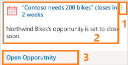

# Create custom cards in Relationship assistant 

Applies to [!INCLUDE[pn_dynamics_crm](../includes/pn-dynamics-crm.md)] (online), version 9.1.0

Action cards provides you up to date information on email, meeting, and much more in [!INCLUDE[pn_dynamics_crm](../includes/pn-dynamics-crm.md)]. These cards reminds you of upcoming activities; it evaluates your communications, and suggests when it might be time to reach out to a contact that’s been inactive for a while; it identifies email messages that may be waiting for a reply from you; it alerts you when an opportunity is nearing its close date; and much more. These cards are displayed on forms, dashboards, and throughout the application to provide relevant information for the context you are working in at the moment.
[!INCLUDE[proc_more_information](../includes/proc-more-information.md)] [Action cards reference](../sales/action-cards-reference.md) 

The action cards contain the following basic elements:

> [!div class="mx-imgBorder"]
>  

1.	**Generics actions:** The more options consist of the following actionable buttons:
    - **Snooze button:** Hides card temporarily. Snooze time varies by card type. Once the snooze time expires the card will again be visible.
    - **Dismiss button:** Dismisses card permanently, regardless of whether you have completed the action.
2. **Actions area:** Provides convenient links that will help you complete whatever type of action the card is recommending. The number (up to two) and types of links provided here vary by card type.
3. **Main content area:** Shows the title of the record the card refers to, its summary, the card type, and other basic information. Click anywhere in this area (except for on the two buttons) to open the related item, which might be a [!INCLUDE[pn_dynamics_crm](../includes/pn-dynamics-crm.md)] record or an email message.

As a developer, you can create new card types according to your organizational requirements and make them available for users.

## Prerequisites
Review the prerequisites before you create the custom cards in your organization:

- You must have the Package Deployer tool (packagedeployer.exe) to deploy packages. To download the package deployer, see [Download tools from NuGet](/dynamics365/customer-engagement/developer/download-tools-nuget)

- Download the extend Relationship assistant card type sample solution

- Build the solution (ExtPkgDeployer.sln)

- Import the package using the package deployer tool

- Verify the new card type

- Create Action card for the new card type using the Web API.

- Verify the new custom card 