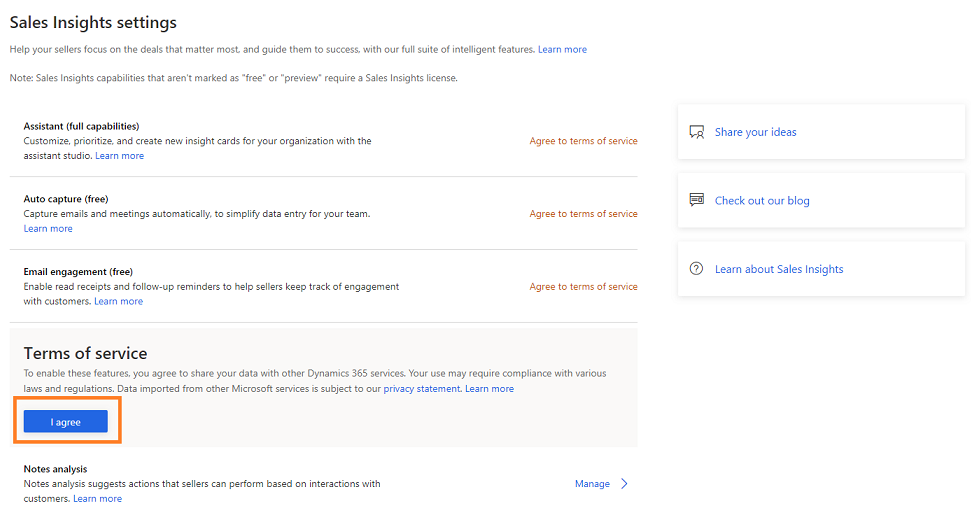
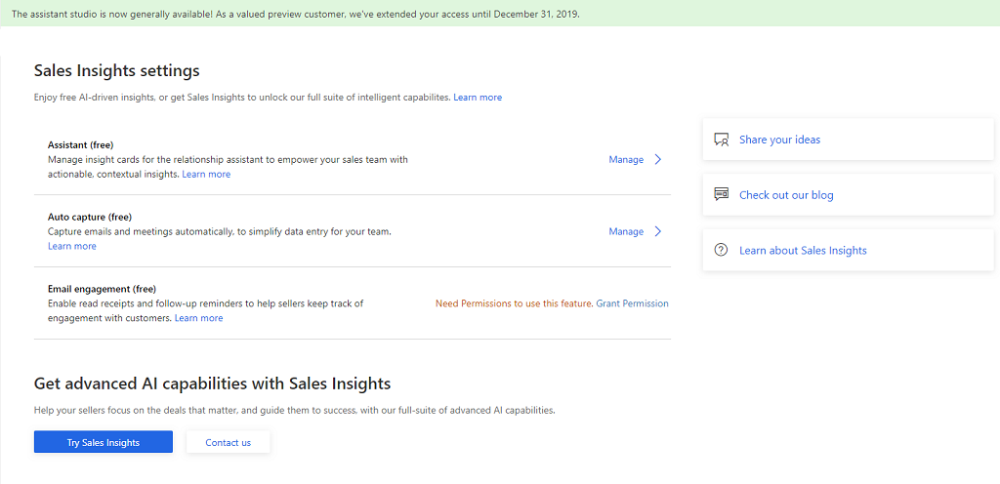
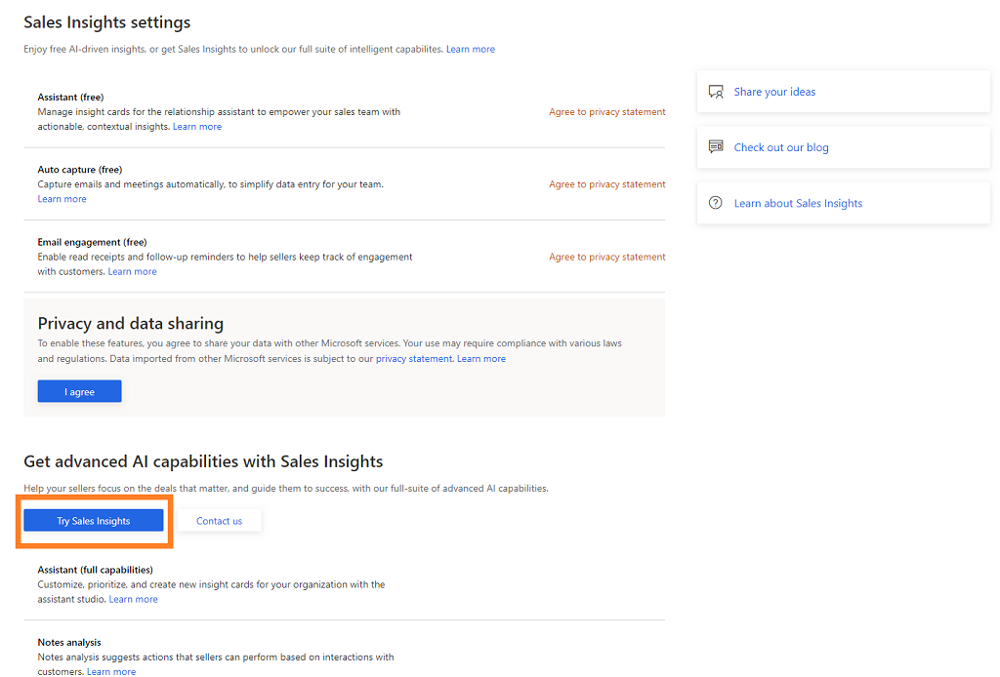
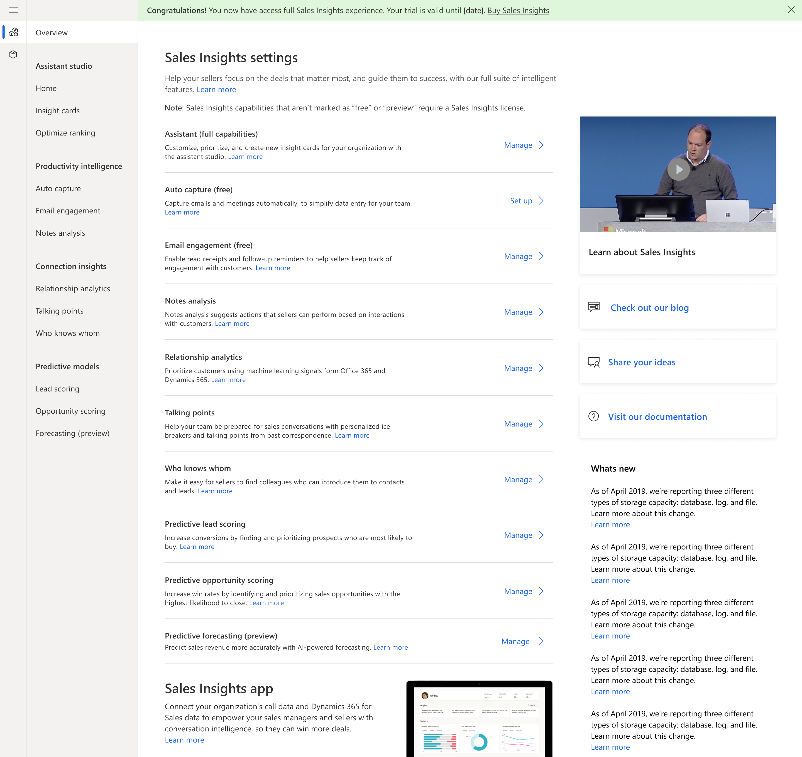

# Introduction to administering Dynamics 365 Sales Insights

Enabling and configuring the [!INCLUDE[pn-dynamics-sales-insights](../includes/pn-dynamics-sales-insights.md)] features helps sellers to use Sales Insights in their organization. In Sales Insights, some features are available for free along with Dynamics 365 Sales and some require an additional Sales Insights license to use in your organization.

As an administrator, you can enable and configure the Sales Insights features as required in your organization. Here are the scenarios you could use to enable and configure Sales Insights features:

-	[Enable and configure free Sales Insights features](#enable-and-configure-free-sales-insights-features)

-	[Enable and configure advanced Sales Insights features](#enable-and-configure-advanced-sales-insights-features)

-	[Administer Sales Insights application](#administer-sales-insights-application)

>[!IMPORTANT]
>Go to **Settings** > **Customization** > **Customize the system** > *Entity* > **General** tab > **Data Services** and ensure that the **Change Tracking** option is always enabled for the following entities for proper installation and effective use of Sales Insights: Account, Contact, Lead, Opportunity, systemuser, Team, Queue, Organization, Email, Phone Call, Task, Appointment, Activity Party,  Connection, Business Unit, Metric, Opportunity Product, Product, Opportunity Sales Process, Process Stage, Connection Role, Workflow, Goal, Role, and System User Roles.   

## Enable and configure free Sales Insights features

The free Sales Insights features—**Assistant (free)**, **Auto capture (free)**, and **Email engagement (free)**—are available for you along with Dynamics 365 Sales. You can configure these free features as required in your organization. The following diagram illustrates the steps to configure these features:

> [!div class="mx-imgBorder"]
> 

1.	[Review requirements and prerequisites](#requirements-and-prerequisites).

2.	[Enable free Sales Insights features](#enable-free-sales-insights-features). 

3.	[Configure the free features as required](#configure-free-sales-insights-features).

### Requirements and prerequisites

Review the following requirements and prerequisites to enable free Sales Insights features:

-	There are some feature restrictions depending on which versions of Dynamics 365 Sales and Office 365 you're running, as detailed in the following table.

    | Product version | Available Sales Insights (free) features |
    |-----------------|------------------------------------------|    
    | [!INCLUDE[pn_crm_8_2_0_online](../includes/pn-crm-8-2-0-online.md)] with [!INCLUDE[pn_Microsoft_Exchange_Online](../includes/pn-microsoft-exchange-online.md)] | <ul><li>Assistant</li> <li>Email engagement</li> <li>Auto capture</li></ul>|
    | [!INCLUDE[pn_crm_8_2_0_online](../includes/pn-crm-8-2-0-online.md)] with [!INCLUDE[pn_Microsoft_Exchange](../includes/pn-microsoft-exchange.md)] (on-premises) | <ul><li>Assistant (not including cards for [!INCLUDE[pn_Exchange](../includes/pn-exchange.md)])</li> <li>Email engagement</li></ul>|
    |[!INCLUDE[pn_crm_8_2_0_op_subsequent](../includes/pn-crm-8-2-0-op-subsequent.md)]| <ul><li>Only Assistant is available, and only its <em>base cards</em> are supported. [!INCLUDE[proc_more_information](../includes/proc-more-information.md)] [Insight cards reference](action-cards-reference.md)</li> <li>No features or insight cards are available for [!INCLUDE[pn_Exchange](../includes/pn-exchange.md)], so your [!INCLUDE[pn_Exchange](../includes/pn-exchange.md)] version isn't important.</li></ul> |

-	Assistant, Email engagement, and Auto capture are available for Dynamics 365 Sales with an Enterprise license only.

-	You must have an administrator or equivalent security role.

### Enable free Sales Insights features

Before you can configure the features, you must accept the privacy notice to enable the configurations. To accept the privacy notice, follow these steps listed here.

> [!IMPORTANT]
> [!INCLUDE[pn-dynamics-sales-insights](../includes/pn-dynamics-sales-insights.md)] provides features that track behavior and collect information about contacts. Make sure you understand the related privacy issues that these features raise and enable the features only if you're certain that they don't violate any privacy policies already in place in your organization. Always take steps to protect the privacy of your contacts.

1.	Sign in to **Dynamics 365 Sales** and go to the **Sales Hub** app.

2.	Go to **Change area** and select **Sales Insights settings**.

    > [!div class="mx-imgBorder"]
    > 
 
3.	On the **Sales Insights settings** page, select **I agree** from the **Terms of service** section.

    > [!div class="mx-imgBorder"]
    > 

    The free Sales Insights features are enabled for your organization and you can configure features such as Assistant (free), Auto capture (free), and Email engagement (free).
 
    > [!div class="mx-imgBorder"]
    > 

### Configure free Sales Insights features

After you enable the free Sales Insights features, you can configure the features for your organization.

-	To configure Assistant (free), see [Configure and manage insight cards for Assistant (free)](configure-assistant.md#configure-and-manage-insight-cards-for-assistant-free).

-	To configure Auto capture (free), see [Configure and enable auto capture](configure-auto-capture.md).

-	To configure Email engagement (free), see [Configure and enable email engagement](configure-email-engagement.md).

## Enable and configure advanced Sales Insights features

The advanced Sales Insights features provide intelligent insights on leads, opportunities, customers, and sales data that help sellers to take timely actions to close deals and generate revenue. The advanced Sales Insights features include **Assistant (full capabilities)** with Studio, **Notes analysis**, **Relationship analytics**, **Who knows whom**, **Predictive lead scoring**, and **Predictive opportunity scoring**. You can configure these features as required in your organization.

The following diagram illustrates the steps to configure these features:

> [!div class="mx-imgBorder"]
> 

1.	[Review GDPR](#review-gdpr).

2.	[Review the prerequisites](#review-the-prerequisites).

3.	[Enable advanced Sales Insights](#enable-advanced-sales-insights).

4.	[Configure advanced Sales Insights features](#configure-advanced-sales-insights-features).

### Review GDPR

To learn about [!INCLUDE[pn_dynamics_sales_insights](../includes/pn-dynamics-sales-insights.md)]-related **General Data Protection Regulation (GDPR)**, see [Dynamics 365 Sales Insights and GDPR](embedded-intelligence-gdpr.md).

### Review the prerequisites

Review the following requirements before you enable and configure the advanced Sales Insights feature:

- You must purchase a **Dynamics 365 Sales Insights** license or start a trial to use advanced Sales Insights features.

- You must be a Dynamics 365 Sales administrator.

- Exchange email server is configured, and mailbox is enabled using **Email Configurations** in Settings. [!INCLUDE[proc_more_information](../includes/proc-more-information.md)] [System Settings dialog box - Email tab](/dynamics365/customer-engagement/admin/system-settings-dialog-box-email-tab).

- If you want to use LinkedIn data for Relationship analytics, verify that the LinkedIn solution is installed in [!INCLUDE[pn-dyn-365-sales](../includes/pn-dyn-365-sales.md)] and write-back from LinkedIn Sales navigator is enabled.

### Enable advanced Sales Insights

The advanced Sales Insights features are not available by default. You must enable these features by accepting the terms and conditions for your organization. To accept the terms and conditions, follow these steps:

1.	Sign in to **Dynamics 365 Sales** and go to the **Sales Hub** app.

2.	Go to **Change area** and select **Sales Insights settings**.

    > [!div class="mx-imgBorder"]
    > 
 
3.	On the **Sales Insights settings** page, select **Try Sales Insights** from the **Get advanced AI capabilities with Sales Insights** section.

    > [!div class="mx-imgBorder"]
    > 
 
4.	On the Sales Insights setup page, carefully read and select the terms and conditions, and then select **Continue**.

    > [!div class="mx-imgBorder"]
    > 
     
    The installation takes a few minutes to complete, and then the status appears in the status bar. After the installation is complete, you are ready to configure the advanced Sales Insights features.

    > [!div class="mx-imgBorder"]
    > 
 
### Configure advanced Sales Insights features

After enabling the advanced Sales Insights features, you can configure the advanced features as required:

-	To configure Assistant (full capabilities), see [Configure and manage insight cards for Assistant (full capabilities)](configure-assistant.md#configure-and-manage-insight-cards-for-assistant-full-capabilities).

-	To configure Notes analysis, see [Configure Notes analysis](configure-notes-analysis.md).

-	To configure Relationship analytics, see [Configure Relationship analytics](configure-relationship-analytics.md).

-	To configure Talking points, see [Configure Talking points](configure-talking-points.md).

-	To configure Who knows whom, see [Configure Who knows whom](configure-who-knows-whom.md).

-	To configure Predictive lead scoring, see [Configure Predictive lead scoring](configure-predictive-lead-scoring.md).

-	To configure Predictive opportunity scoring, see [Configure Predictive opportunity scoring](configure-predictive-opportunity-scoring.md).

## Administer Sales Insights application

The **Sales Insights** application assists the sales managers and sellers in your organization to get an overview of the conversation with customers. The **Sales Insights** application helps:

-	Sales managers drill down to get call statistics for individual sellers, such as customer sentiment, keywords used, and competitors mentioned in the conversation. Sales managers can use this data to give smarter coaching to sellers and improve the business.

-	Sellers analyze their conversation data and identify improvements in the conversation style to enhance sales and generate revenue.

As an administrator, when you sign in to the application for the first time, you can set up the application. After you complete the setup, sales managers and sellers in your organization can sign in and use the application seamlessly. To learn more, see [First-run setup experience of Sales Insight application](fre-setup-sales-insight-app.md).

You can also update each setting later as required. The following are the available configurations:

-	Connect your Dynamics 365 Sales environment to gather data and display on KPIs. To learn more, see [Connect to Dynamics 365 Sales environment](connect-dynamics365-sales-environment.md).

-	Connect to call data repository. To learn more, see [Configure conversation intelligence to connect call data](configure-conversation-intelligence-call-data.md).

-	Define keywords and competitors that will be tracked in conversations. To learn more, see [Configure keywords and competitors to track](configure-keywords-competitors.md).

-	Define how long you want to retain the data in the application and remove seller-specific data. To learn more, see [Data retention and deletion through Privacy](data-retention-deletion-policy.md).

-	Enable preview features. To learn more, see [Enable preview features](enable-preview-features-sales-insights-app.md).

## Privacy notice

For specific privacy information about Dynamics 365 Sales Insights capabilities, see [Privacy notice](privacy-notice.md).

### See also

[Overview of Dynamics 365 Sales Insights](overview.md)

[Improve seller coaching and sales potential with Dynamics 365 Sales Insights application](../sales/dynamics365-sales-insights-app.md)

[Dynamics 365 Sales Insights and GDPR](embedded-intelligence-gdpr.md)

[Sales Insights privacy notice](privacy-notice.md) 
