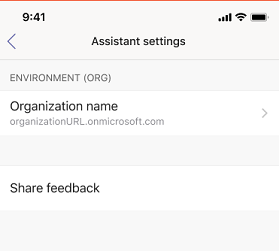
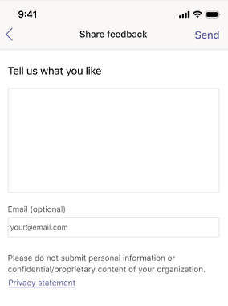

# Learn the basics

[!INCLUDE [cc-beta-prerelease-disclaimer](../includes/cc-beta-prerelease-disclaimer.md)]

> [!IMPORTANT]
> - [!INCLUDE[cc_preview_features_definition](../includes/cc-preview-features-definition.md)]  
> - [!INCLUDE[cc_preview_features_expect_changes](../includes/cc-preview-features-expect-changes.md)]
> - Microsoft doesn't provide support for this preview feature. Microsoft Dynamics 365 Technical Support won’t be able to help you with issues or questions. Preview features aren't meant for production use and are subject to a separate [supplemental terms of use](https://go.microsoft.com/fwlink/p/?linkid=870960).

When you open the Dynamics 365 assistant app in Teams on your mobile device, you’ll see the home page. This home page provides high-level information on the meetings and insights cards that are specific to you. Typically, the home page displays as following:

> [!div class="mx-imgBorder"]
> 

1.	[Highlighted meetings](#highlighted-meetings)
2.	[Highlighted insights](#highlighted-insights)
3.	[Settings](#settings)
4.	[Bot](#bot)

## Highlighted meetings

The meetings for current day are displayed along with the participants, regarding, and related entities. To learn more see [Working with meetings](working-with-meetings-teams.md).

## Highlighted insights

The highlighted insight section displays the insight cards that are most important and with relevant information about what you must do next. You can perform the defined actions on the cards such as open, send email, snooze, and dismiss. You can open the card to see the details and what the card is regarding. To learn more, see [Use assistant to guide customer communications](relationship-assistant.md).

## Settings

The settings option allows you to change your organization, send feedback, and information about the app version. 

> [!div class="mx-imgBorder"]
> 

The organization option helps you to change the organization and view the information regarding the selected organization. To learn more, see [Change sales organization](change-sales-organization.md).

To send feedback, select **Share feedback**. A pop up appears on the bottom of the screen with options: **Tell us what you like** and **Tell us how we can get better**. Select the feedback option appropriately. On the feedback form, enter the information that you would like to share with us and your email. Sharing your email is optional and if you share, it helps us to gather more information on the feedback that you have shared and receive communication on the status. After you enter the necessary information, select **Send**. 

The following image is an example of **Tell what you like feedback** form.

> [!div class="mx-imgBorder"]
> 

## Bot

The bot allows you to search your organization for records within the Dynamics 365 app in Teams. To learn more, see [Get answers through bot assistant]().

### See also

[Overview of Sales Insights applications](../sales/dynamics365-sales-insights-app.md)

[Install Dynamics 365 application on Microsoft Teams](install-assistant-application-microsoft-teams.md)