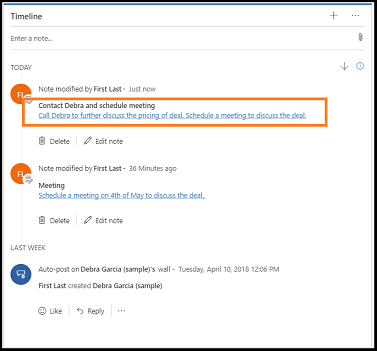
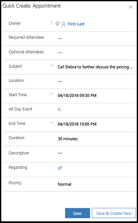

# How Notes analysis assists you with intelligent suggestion

[!INCLUDE[pn_dynamics_crm](../includes/pn-dynamics-crm.md)] allows you to view and quickly enter notes on **Timeline** control (formerly known as activity wall). When you enter notes regarding a recent meeting or discussion with your customer, [!INCLUDE[pn_dynamics_crm](../includes/pn-dynamics-crm.md)] monitors these notes and gives you intelligent suggestions. With these suggestions, you can save time and effort by taking actions such as creating a meeting request and adding a contact then and there on the note. 
**Timeline** control is available on contacts, opportunities, leads, accounts, and case forms. 
 
When you save a note, the text in the note is highlighted and when selected, suggestions are displayed. These suggestions include: Creating activities, tasks, contacts, meeting, content requests, and issue detection. 
For example, you created a note “Meet the customer on the May 4 at 4:00 PM”. When you select this text, Dynamics 365 provides an automatic suggestion to create an appointment. 
 
When you have multiple suggestions associated with a note, [!INCLUDE[pn_dynamics_crm](../includes/pn-dynamics-crm.md)] displays those multiple suggestions—you can take timely actions depending on your requirements. 
For example, you have created a note to contact your customer regarding pricing and schedule a meeting to further discuss the deal. The note shows suggestions to create an appointment and schedule a phone call. Let's look this example to see how suggestion-based notes work with multiple suggestions:

1. Open a record with the note and select the note text.   
    In this example, the note specifies to call Debra to discuss the pricing of deal and schedule a meeting to discuss meeting. 
     
    Suggestions to create an appointment and a phone call are displayed. 
     
    Use the arrow icon to switch between the suggestions.  
2. On the **New Appointment suggestion** card, select **Edit and Create**. 
    The **Quick Create: Appointment** form opens with populated information from the note.
     
3. Edit the necessary information and select **Save**. 
4. Similarly, repeat step 2 and 3 for **New phone call suggestion**. 
    A new appointment and a call are scheduled for the record. 

### See also

[Configure Dynamics 365 AI for Sales](configure-enable-sales-insights-addon.md)