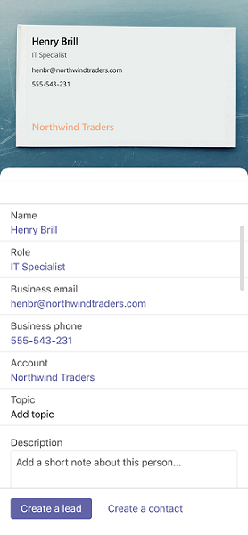
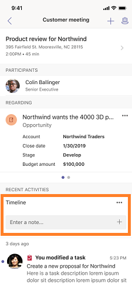

# Scan business cards and meeting notes

[!INCLUDE [cc-beta-prerelease-disclaimer](../includes/cc-beta-prerelease-disclaimer.md)]

> [!IMPORTANT]
> - [!INCLUDE[cc_preview_features_definition](../includes/cc-preview-features-definition.md)]  
> - [!INCLUDE[cc_preview_features_expect_changes](../includes/cc-preview-features-expect-changes.md)]
> - Microsoft doesn't provide support for this preview feature. Microsoft Dynamics 365 Technical Support won’t be able to help you with issues or questions. Preview features aren't meant for production use and are subject to a separate [supplemental terms of use](https://go.microsoft.com/fwlink/p/?linkid=870960).

The Dynamics 365 assistant app provides an integrated scan option that allows you to quickly create or add notes, contacts, and tasks. For example, when you complete a meeting with a potential customer, you can use the scan option to scan the business card and create a contact. You also can scan handwritten notes to generate tasks and notes in Dynamics 365 Sales.

>[!NOTE]
>You must have the **Common Data Service User** role assigned to you to use the business card and note scan control.

The app provides the following options:

-	[Scan business cards](#scan-business-cards)

-	[Scan meeting notes](#scan-meeting-notes)

## Scan business cards

The scan business card option helps you as a salesperson to quickly create contacts in the app and then store them in your Dynamics 365 Sales organization. When you scan a business card, it reads basic information from the card and populates data in the fields of lead or contact records in Dynamics 365 Sales. This helps you to spend your valuable time on more important tasks than entering data manually.

To scan a business card, follow these steps:

1.	Open the Dynamics 365 assistant app on Teams on mobile.

2.	On the home page, select **Add menu** (**+**). The options to scan slide from the bottom.

    > [!div class="mx-imgBorder"]
    > 

3.	Select **Scan a business card**. The mobile camera opens to scan the business card. 

    > [!div class="mx-imgBorder"]
    > 

4.	Face the camera toward the business card and ensure that the card remains within the scan area (rectangular area). Snap a photo of the card. 

    The details of the card such as name, role, business email, business phone, and account are captured on the creation form. 

    > [!div class="mx-imgBorder"]
    > 

5.	Review the captured information. If you find any information that needs updating, you can select the field and update the information.

6.	Select **Create a contact** according to your requirement.

    The contact is created in your Dynamics 365 Sales organization.

## Scan meeting notes

The scan notes option in Dynamics 365 assistant app for Teams helps you as a salesperson to quickly scan handwritten meeting notes. When scanned, the application suggests actions based on the scanned notes such as creating a task and adding notes.

You can open the note scanner in two ways:

-	On the home page through **Add menu** (**+**). To learn more, see [Scan notes from Add menu](#scan-notes-from-add-menu).

-	On a meeting page through **Add a note** or **Enter a note**. To learn more, see [Scan notes within a meeting](#scan-notes-within-a-meeting)

### Scan notes from Add menu

1.	Open the Dynamics 365 assistant app on Teams on mobile.

2.	On the home page, select **Add menu** (**+**) and then select **Scan a note**. 

    > [!div class="mx-imgBorder"]
    > 

    The mobile camera opens to scan the handwritten notes.

3.	Face the camera toward the note and ensure that the note remains with in the scan area. Snap a photo of the note. 

    The application processes the captured details from the notes and displays them in a scanned text area.

    > [!div class="mx-imgBorder"]
    > 

4.	Review the scanned text. If any changes are required, update the information.

5.	Select **Suggest updates**. The application processes the scanned text and provides suggestions to add tasks and a note.

    > [!div class="mx-imgBorder"]
    > 

6.	If no entity is suggested for the scanned note, an option to set an entity is displayed. Select **Set regarding** and then add the relevant entity for the note. To learn more about adding an entity, see [Regarding entity](working-with-meetings-teams.md#regarding-entity). 

7.	If you want to edit information in the tasks and notes, select **Edit** corresponding to the task or note.

    -	For tasks, update the information such as description, due date, and priority, and select **Done**.

    -	For a note, edit the note with the new information and select **Done**.

8.	Select **Update**. 

    The suggested tasks and notes are added to the entity in your Dynamics 365 Sales organization.

### Scan notes within a meeting

1.	Open the Dynamics 365 assistant app on Teams on mobile.

2.	If the meeting is completed, select **Add a note**. 

    > [!div class="mx-imgBorder"]
    > 
 
    -OR-

    If the meeting is not completed, open the meeting and select **Enter a note** on the **Timeline**.

    > [!div class="mx-imgBorder"]
    >    

3.	Select **Scan a note** and the mobile camera opens to scan the handwritten notes.

4.	Face the camera toward the note and ensure that the note remains within the scan area. Snap a photo of the note. 

    The application processes the captured details from the notes and displays them in a scanned text area.

    > [!div class="mx-imgBorder"]
    > 

5.	Review the scanned text. If any changes are required, update the information.

6.	Select **Suggest updates**. The application processes the scanned text and provides suggestions to add tasks and a note.

    > [!div class="mx-imgBorder"]
    > 

7.	If you want to edit information in the tasks and notes, select **Edit** corresponding to the task or note.

    -	For tasks, update the information such as description, due date, and priority and then select **Done**.

    -	For a note, edit the note with the new information and select **Done**.

8.	Select **Update**. 

    The suggested tasks and notes are added to the entity in your Dynamics 365 Sales organization.

### See also

[Learn the basics](learn-basics-dynamics-365-application-teams.md)

[Install Dynamics 365 application on Microsoft Teams](install-assistant-application-microsoft-teams.md)
