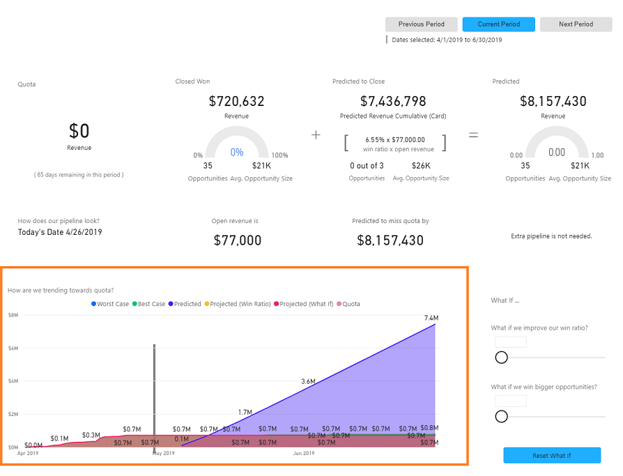
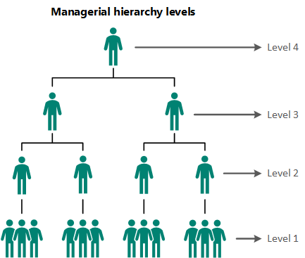

<!--# Public preview: Analyze revenue outcome using Predictive forecast-->

Applies to [!INCLUDE[pn-crm-online](../includes/pn-crm-online.md)] version 9.1.0.

[!INCLUDE [cc-beta-prerelease-disclaimer](../includes/cc-beta-prerelease-disclaimer.md)]

> [!IMPORTANT]
> [!INCLUDE[cc_preview_features_definition](../includes/cc-preview-features-definition.md)]  

In today’s competitive environment, it is important for you to stay on top of your business to achieve and go beyond your sales targets. Predictive forecasting, a new feature, allows you to predict your sales for the current period thus providing you more visibility into your business. 

To analyze and predict the future revenue outcome, the Predictive forecasting feature uses your historical opportunities. If there is not enough data, the Predictive forecasting feature cannot create a forecasting model to display on the forecast report.

After the feature is enabled, you must open the **Sales Insights** app and go to the **Business** tab. The **Predictive forecast** tab is available for you to view the forecasting trend.

> [!NOTE]
> If you are unable to see **Predictive forecast** tab, contact your administrator. To learn more, see [Configure Predictive Forecasting](../sales/configure-enable-dynamics-365-ai-sales#public-preview-configure-predictive-forecast). 

### Understand forecast data
The following is an example of how Predictive forecasting displays:

> [!div class="mx-imgBorder"]
> 

To learn more about other parameters such as filters, quota, and revenue, see [Forecast](../sales/d365-ai-business-performance.md#forecast)

The graph you see is in line chart format where the x-axis and y-axis represent the timeline and revenue, respectively.

This line plot spans across the report and represents predictive forecast revenue that is projected for the current sales period. The forecast revenue projection varies depending on how you’ve historically performed on the opportunities that are available under you and your hierarchy. The projection of predictive forecast revenue refreshes every week and new revenue projection is displayed from the current point to the future.

For example, your fiscal period is set to quarterly—January 1 to March 31. The revenue projection shows from January 1 until March 31. If today is February 7, the predictive forecasting retrains the projection based on the historical opportunities until February 7 and displays new revenue projections from this day (February 7) to March 31 (end of period).

The forecast revenue data that displays on Predictive forecasting depends on the number of levels of hierarchy defined for you. At any given time, you could see only the prediction and actual revenue of up to three levels that are below you.

> [!NOTE]
> Predictive forecasting supports up to three levels of hierarchy from level 1, your sellers. To learn more about hierarchy, see [Set up manager and position hierarchies](/dynamics365/customer-engagement/admin/hierarchy-security#set-up-manager-and-position-hierarchies).

Let’s look at the example to understand more:

> [!div class="mx-imgBorder"]
>  

The matrix explains when you are a manager who is at a level and when you open Predictive forecasting, you see the revenue projection based on the historical opportunities that you and your hierarchy own.

| Managerial level   | Revenue projection |
|--------------------|--------------------|
|L2|You and your hierarchy own. (Yours + L1)|
|L3|Includes the managers who are at level 2 and their hierarchy. (Yours + L2 + L1)|
|L4|Includes the managers who are at level 2 and level 3, and their hierarchy. (Yours + L3 + L2 + L1)|
