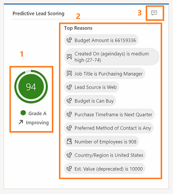

# Work with Predictive lead scoring

Applies to Dynamics 365 (online), version 9.0.2  

In a highly competitive market, it is important for you to spend time on quality leads to reach your sales targets. So, you must identify and prioritize leads to convert them onto opportunities. The Predictive lead scoring of Dynamics 365 AI for Sales provides a scoring model to generate scores for leads that are available for you in your pipeline. This model assigns a score between 0 to 100 for leads based on the signals from leads and related entities such as contact and account. Using these scores, you can identify and prioritize leads that have more chances of converting into opportunities.  
For example, there are two leads - Lead A and Lead B in your pipeline. The lead scoring model applies a score of 80 for Lead A and 50 for Lead B. by looking at the score, you can predict that Lead A has more chances of converting into opportunity and you can engage it. Also, you can further analyze why score of Lead B is low by looking at the top reasons that are influencing the score and take a decision to improve this score.
 
> [!IMPORTANT]
> To enable Predictive lead scoring in your organization, contact your system administrator. [!INCLUDE[proc_more_information](../includes/proc-more-information.md)] [Configure Predictive lead scoring](configure-enable-dynamics-365-ai-sales.md#configure-predictive-lead-scoring)

## Understand predictive lead scoring in views
The **My Open Leads Scored** system view is available for you When the Predictive lead scoring is enabled in your organization. This view provides a list of leads with different parameters including lead score, lead grade, and lead score trend. By analyzing these parameters, you can  identify and prioritize leads to convert into opportunities. 

The following screen displays a typical view that consist of columns which can be used to analyze and prioritize the leads. 

The numbered columns are:
1.	**Lead Score.** Specifies the value that is representative of the likelihood of the lead to convert into an opportunity on a scale of 1 - 100. A lead with score of 100 has the highest likelihood of converting into an opportunity.
2.	**Lead Grade.** Specifies the grades of a lead that are categorized into A, B, C, and D with colors green, purple, yellow, and red, respectively, where Grade A (green) is the lead with highest likelihood for conversion into an opportunity followed by Grade B (purple), Grade C (yellow), and Grade D (red). System administrator can define lead score ranges for a grade, depending on your organizational requirements.
3. **Lead Score Trend.** Specifies the direction in which a lead is trending such as **Improving** (up arrow), **Declining** (down arrow), **Steady** (right arrow), or **Not enough info**. These trends are displayed by comparing the present lead score with the previous score. For example, the score of a lead was 65 and the present score is decreased to 45, a down arrow is displayed in the **Lead Score Trend** column specifying that the lead is losing traction and needs some action from you to improve the score. 
 
## Analyze and improve your lead score

In forms, you can use the **Lead Score** widget to see the top ten reasons that are influencing the score. These reasons come from the lead attributes and attributes from the related entities. This helps you to analyze and work on the lead to improve the score and convert it into a possible opportunity.  
The following screen displays a typical Lead Score widget with reasons that are influencing the lead score.  

The numbered sections are:
1.	**Basic Information.** Displays the basic information of a lead—such as lead score, lead grade, and lead score trend—to help you avoid going back to the My Open Leads Scored view to see basic information.
2.	**Top Reasons.** Displays the list of reason that are affecting the lead score. This helps you to analyze and consider the lead for converting into an opportunity. You can also take necessary actions to improve the lead score, such as set up meetings and follow-ups.  
3.	**Feedback.** Displays feedback that's provided by a user to a lead. You can change the feedback with an appropriate lead score.
    To provide feedback, select the **Chat** icon and enter the expected score and comments. To save the feedback, select **Send**.

## Privacy notice  

For specific privacy information about Dynamics 365 AI for Sales capabilities for sellers, see [Privacy notice](privacy-notice-seller.md).

### See also

[Configure and enable sales insights add-on](configure-enable-dynamics-365-ai-sales.md)
