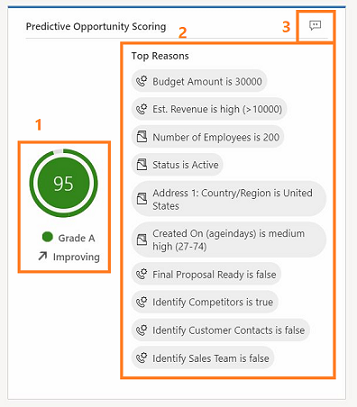

# Convert opportunities into deals

Applies to [!INCLUDE[pn-crm-online](../includes/pn-crm-online.md)] version 9.1.0.

In a highly competitive market, it is important for you to spend time on quality opportunities to reach your sales targets. You must identify and prioritize opportunities to convert them into wins. The Predictive opportunity scoring of Dynamics 365 Sales Insights provides a scoring model to generate scores for opportunities in your pipeline. This model assigns a score between 0 and 100 for opportunities based on the signals from opportunities and related entities such as contact and account. Using these scores, you can identify and prioritize opportunities that have more chances of converting into wins. 

For example, say you have two opportunities - Opportunity A and Opportunity B - in your pipeline. The opportunity scoring model applies a score of 75 for Opportunity A and 55 for Opportunity B. By looking at the score, you can predict that Opportunity A has more chances of converting into a win deal and you can engage it. Also, you can further analyze why the score of Opportunity B is low by looking at the top reasons that are influencing the score and deciding how to improve this score.

> [!IMPORTANT]
> To enable Predictive opportunity scoring in your organization, contact your system administrator.
> [!INCLUDE[proc_more_information](../includes/proc-more-information.md)] [Configure Predictive opportunity scoring](configure-enable-dynamics-365-ai-sales.md#configure-predictive-opportunity-scoring)

## Understand opportunity scoring in views

The **My Open Opportunities Scored** system view is available for you when Predictive opportunity scoring is enabled in your organization. This view provides a list of opportunities with different parameters, including opportunity score, opportunity grade, and opportunity score trend. By analyzing these parameters, you can identify and prioritize opportunities to convert into win deals.

The following screen displays a typical view that consists of columns that can be used to analyze and prioritize the opportunities.

> [!div class="mx-imgBorder"]
> 

The numbered columns are:

1. **Opportunity Score.** Specifies the value that represents the likelihood of the opportunity to convert into a deal on a scale of 1 to 100. An opportunity with score of 100 has the highest likelihood of converting into a win deal.

1. **Opportunity Score Trend.** Specifies the direction in which an opportunity is trending such as **Improving** (up arrow), **Declining** (down arrow), **Steady** (right arrow), or **Not enough info**. These trends are displayed by comparing the present opportunity score with the previous score. For example, the score of an opportunity was 65 and the present score has decreased to 45. A down arrow is displayed in the **Opportunity Score Trend** column specifying that the opportunity is losing traction and needs some action from you to improve the score.

1. **Opportunity Grade.** Specifies the grades of an opportunity that are categorized into A, B, C, and D with colors green, purple, yellow, and red, respectively, where Grade A (green) is the opportunity with highest likelihood for conversion into a win deal followed by Grade B (purple), Grade C (yellow), and Grade D (red). The system administrator can define opportunity score ranges for a grade, depending on the organizational requirements. 

## Analyze and improve your opportunity score

In forms, you can use the **Opportunity Score** widget to see the top 10 reasons that are influencing the opportunity score. These reasons come from the opportunity attributes and attributes from the related entities. This helps you to analyze and work on the opportunity to improve the score and convert it into a win deal.

The following screen displays a typical **Opportunity Score** widget with the reasons that are influencing the opportunity score.

> [!div class="mx-imgBorder"]
> 

The numbered sections are:

1. **Basic Information.** Displays the basic information of an opportunity—such as opportunity score, opportunity grade, and opportunity score trend—to help you avoid going back to the **My Open Opportunities Scored** view to see basic information.

2. **Top Reasons.** Displays the list of reasons that are affecting the opportunity score. This helps you to analyze and consider the opportunity for converting it into a win deal. You can also take necessary action to improve the opportunity score, such as set up meetings and follow-ups.

3. **Feedback.** Displays feedback that's provided by a user to an opportunity. You can change the feedback with an appropriate opportunity score. To provide feedback, select the **Chat** icon and enter the expected score and comments. To save the feedback, select **Send**.

## Privacy notice  

For specific privacy information about [!INCLUDE[pn_dynamics_ai_sales](../includes/pn-dynamics-ai-sales.md)] capabilities for sellers, see [Privacy notice](privacy-notice-seller.md).

### See also

[Configure and enable Dynamics 365 Sales Insights](configure-enable-dynamics-365-ai-sales.md) 
