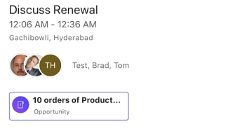
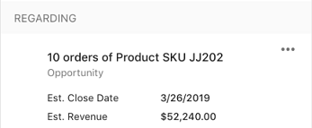
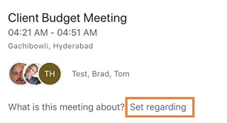
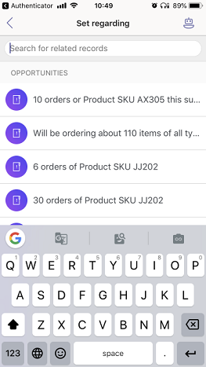
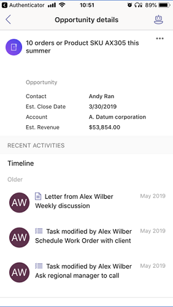

# Working with meetings

[!INCLUDE [cc-beta-prerelease-disclaimer](../includes/cc-beta-prerelease-disclaimer.md)]

> [!IMPORTANT]
> - [!INCLUDE[cc_preview_features_definition](../includes/cc-preview-features-definition.md)]  
> - [!INCLUDE[cc_preview_features_expect_changes](../includes/cc-preview-features-expect-changes.md)]
> - Microsoft doesn't provide support for this preview feature. Microsoft Dynamics 365 Technical Support won’t be able to help you with issues or questions. Preview features aren't meant for production use and are subject to a separate [supplemental terms of use](https://go.microsoft.com/fwlink/p/?linkid=870960).

The Dynamics 365 assistant app for Teams provides information on your daily meetings on your mobile devices. This helps you to prepare for an upcoming meeting so that you can build a strong relationship with customers. These meetings display the list of participants who are external and not in your organization. The app displays meetings that are related to your current day and are up to date as the app syncs in real-time with Office 365 account. 

The meetings provide basic information such as subject, time and location, participants, regarding entities, and related entities. The following image is an example of a meeting card:

> [!div class="mx-imgBorder"]
> 

To view more details, select and open the meeting. The **Meeting preparation** page opens with detailed information. The following image is an example of a meeting preparation page:

> [!div class="mx-imgBorder"]
> 

The meeting preparation page is typically divided into the following sections:

1.	[Meeting information](#meeting-information) 

2.	[Participants](#participants)

3.	[Regarding entity](#regarding-entity)

4.	[Activity timeline and insight cards](#activities-timeline-and-insights-cards)

## Meeting information

The meeting preparation section provides information on the subject, when the meeting is scheduled, and where the meeting is happening. This information is view only and you cannot edit in the app. 

## Participants

Participants are the customers and the organizer who are attending the meeting. You can see the number of participants who will be attending the meeting with the acceptance status such as accepted, tentative, and declined. 

### Add new customer contact

If a customer in the participant list is not in your contacts, you can add such customer to contact list in Dynamics 365 Sales organization. These contacts are displayed under the **NEW CONTACT** section. 

Select the contact and the contact opens. On the customer details page, select add to Dynamics 365 from the bottom of the page.
The customer is added to the contact list in the Dynamics 365 Sales organization.

### View details of a customer

To view more details about a customer, select the contact. The following details are displayed:

-	Contact information of the customer such as mobile number and business email.

-	Colleagues in your organization who knows and can introduce you to this contact. To learn more, see [How to get introduced to a lead](who-knows-whom.md).

-	Talking points to start a conversation with the added customer. To learn more, see [Know conversation starters for your customers](talking-points.md).

## Regarding entity

The regarding entity specifies what the meeting is about such as opportunity, lead, contact, or account. When a meeting is attached to an entity, only then the meeting displays the timeline, insight, participants information, and its corresponding related entities. Also, the regarding entity helps you to understand what the meeting is about, and you can come prepared with relevant information.

In the following image, you can see that the meeting is regarding an opportunity that has **10 orders of product with SKU JJ202**.

> [!div class="mx-imgBorder"]
> 

### View regarding and related entities

To view more details about the regarding entities, select the entity. The details such as timeline activities and relevant cards are displayed along with related entities cards. Also, related entities are displayed if there are any related entities are attached to the regarding entity. You can swipe to view the related entities. 

> [!div class="mx-imgBorder"]
> 

To view the entity in Dynamics 365 assistant application, from the **REGARDING** section, select more options (**…**) and then select **Open in Dynamics 365**.

### Add regarding entity

you can add a regarding entity to a meeting when there is no regarding entity attached it. When you add the regarding entity, its corresponding related entities are also added to the meeting. 

> [!NOTE]
> Once you add a regarding entity, you cannot delete. However, you can update the entity if you find the added entity is inappropriate. 

To add regarding entity, follow these steps:

1.	On the meeting card, select **Set regarding**.

    > [!div class="mx-imgBorder"]
    >  

    -OR-

    On the **Meeting preparation** page, under **REGARDING** section, select **Set regarding**. 

    > [!div class="mx-imgBorder"]
    >  

2.	The **Set regarding** page opens, select a regarding field from the list of entities.

    > [!div class="mx-imgBorder"]
    > 
 
    The regarding entity is added to the meeting along with its corresponding related entities.

### Update regarding entity

You can update the regarding entity when it is no more relevant or there are changes to the meeting. To update the regarding entity, follow these steps:

1.	Select and open the meeting. The **Meeting preparation** page opens with detailed information.

2.	From the **REGARDING** section, select more options (**…**) and then select **Change regarding record**.

## Activities timeline and insights cards

See a combined view of your and customer’s interactions across various channels, such as phone, email, or even social activities in the Timeline that are related to the regarding entity. The Timeline also shows any related notes or system posts. Also, cards are displayed below the timeline based on the related entities.

This timeline activities and cards are fetched from your Dynamics 365 Sales organization for the selected regarding entity.

The following image is an example of an activity timeline for an opportunity regarding entity:

> [!div class="mx-imgBorder"]
> 

### See also

[Install Dynamics 365 assistant application on Microsoft Teams](install-assistant-application-microsoft-teams.md)

[Overview of Dynamics 365 assistant](overview-dynamics-365-assistant-app-teams.md)